# Mangrove Change and Biogeographical Drivers in Palawan

This project analyzes the spatial and temporal dynamics of mangrove cover change in Palawan, Philippines (1996–2020), and investigates the environmental and anthropogenic factors influencing mangrove loss using regression and spatial modeling techniques.

---

## 🔍 Objectives

1. **Map and quantify** spatial and temporal patterns of mangrove cover change using Global Mangrove Watch data (1996, 2010, 2015, 2020).
2. **Analyze** the relationship between mangrove change and drivers using Ordinary Least Squares (OLS) logistic regression.
3. **Evaluate** the spatial variability of driver influence using Geographically Weighted Regression (GWR).

---

## 📂 Folder Structure

```
data/
├── mosaics/                # Mangrove rasters (yearly mosaics)
├── mangroves_filtered/     # Tiles clipped to Palawan
├── processed_rasters/      # Preprocessed explanatory rasters
├── csv/                    # Extracted regression datasets
├── stats/                  # Summary stats, regression results
├── gwr_outputs/            # GWR coefficient GeoJSONs
├── admin_boundaries/       # Municipal boundaries
```

---

## 🧭 Methodological Workflow

```mermaid
flowchart TD

%% Input Sources
A1[Download GMW Mangrove Rasters]
A2[Download Explanatory Rasters: CHIRPS, LST, GPW, ESA, SRTM]

%% Mangrove Processing
A1 --> B1[Prepare Mangrove Tiles: Clip and Mosaic]
B1 --> C1[Perform Change Detection: 1996–2010, 2010–2015, 2015–2020]
C1 --> D1[Compute Gain, Loss, No Change]

%% Explanatory Data Prep
A2 --> B2[Preprocess Explanatory Rasters: Clip, Align, Resample]
B2 --> C2[Match Raster Years and Extract Values]

%% Aligning Step: Centroids and CSV
D1 --> E1[Generate Centroid Points]
C2 --> E2[Extract Predictor Values per Loss Pixel]
E1 --> F1[Save Combined Dataset to CSV]
E2 --> F1

%% Visualization
E1 --> V1[Visualize Loss and Gain Heatmaps in QGIS]

%% OLS Regression Path
F1 --> R1[Logistic Regression per Interval]
R1 --> R2[Summarize OLS Coefficients]
R2 --> R3[Check OLS Multicollinearity]
R3 --> R4[Evaluate OLS Fit: R², AIC, LLF]

%% GWR Path
F1 --> GWR1[Run GWR per Interval]
GWR1 --> GWR2[Extract Spatial Coefficients]
GWR2 --> GWR3[Summarize GWR Trends and Importance]
GWR3 --> GWR4[Evaluate GWR Fit: R², AIC, LLF]
```



---

## 📦 Key Tools and Libraries

- `rasterio`, `numpy`, `geopandas` for spatial preprocessing
- `statsmodels` for logistic regression
- `mgwr` for spatial modeling (GWR)
- `QGIS` for heatmap visualization
- Data sources: Global Mangrove Watch, CHIRPS, MODIS LST, GPW v4, ESA CCI, SRTM

---

## 🗺️ Outputs

- Change maps and centroids for mangrove loss/gain
- Municipality-level loss/gain statistics
- Predictor-prepared CSVs (2010, 2015, 2020)
- OLS regression summaries and importance rankings
- GWR coefficient maps and model evaluations
